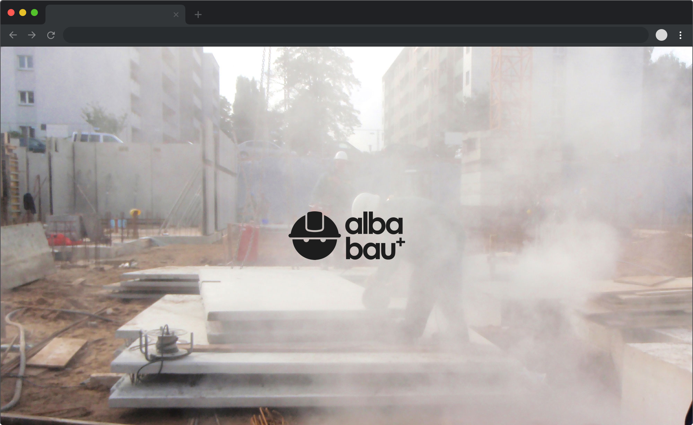

# Alba Bau Plus - Company home page
> Flexbox Layout Exercise

## Table of contents
* [General info](#general-info)
* [Screenshots](#screenshots)
* [Technologies](#technologies)
* [To-do list](#to-do-list)
* [See live](#see-live)

## General info
This is a small project, part of the Codecademy Full-stack Engineer Course, which uses flexbox to create a responsive home page of a construction company.

## Screenshots

## Technologies
* HTML
* CSS - flexbox for responsive design
* JavaScript for mobile menu

## To-do list
* Add gallery feature for Projects section to be able to include more photos for each project. Add left and right arrow and maybe lightbox.

## See live 
Visit [this link](https://www.atanasdim.com/alba-responsive-flexbox)
